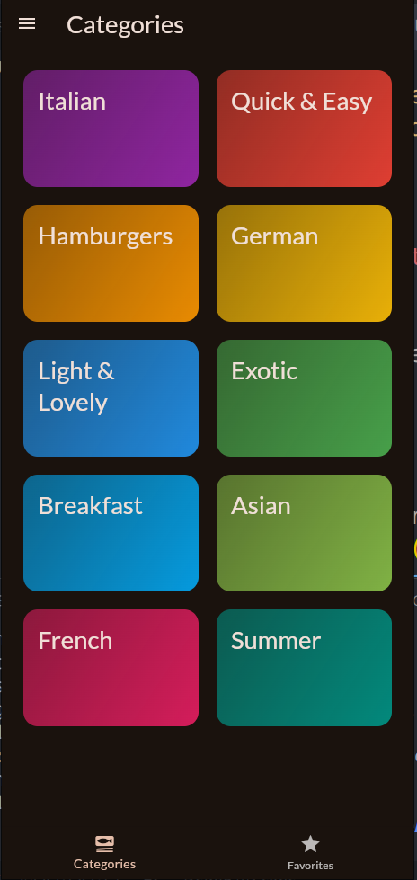
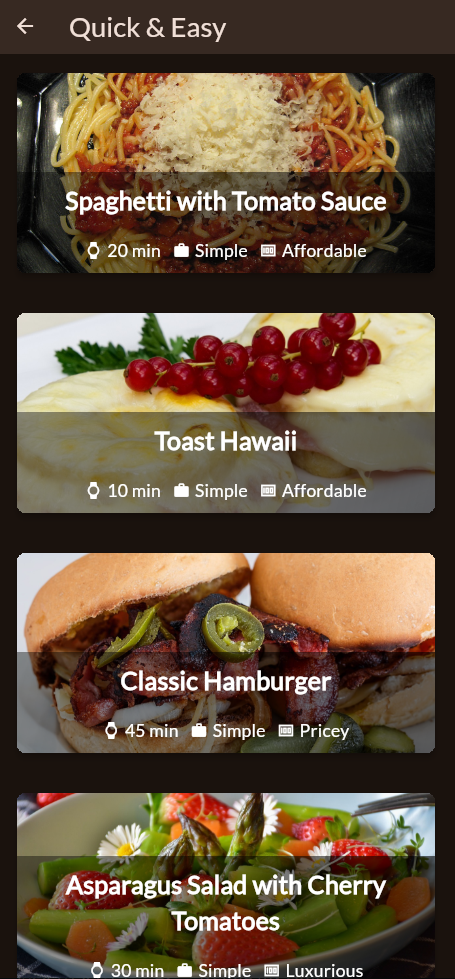
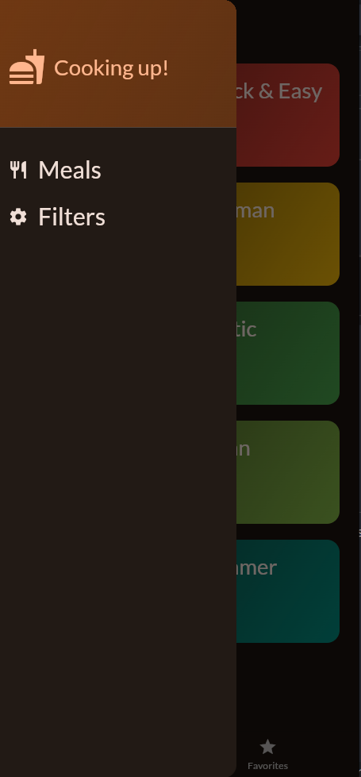
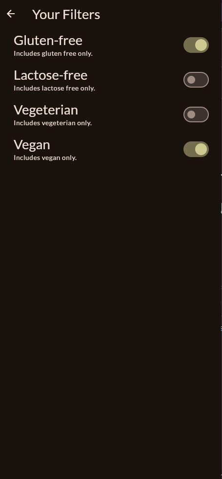
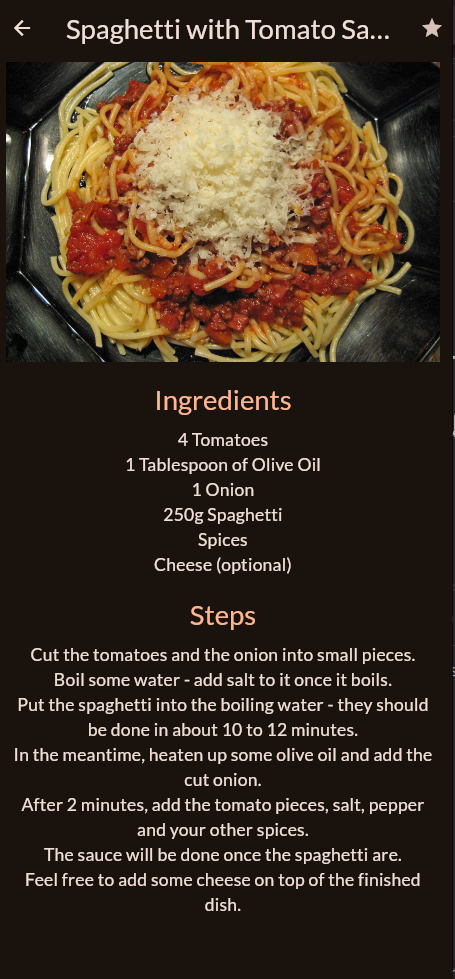

# Meal App 🍽️

Welcome to **Meal App**, a Flutter-powered app to explore meals, filter them by dietary preferences, and save your favorites—all with a clean, user-friendly interface. Whether you’re gluten-free, vegan, or just love good food, this app’s got you covered!

## Features ✨

- **Meal Categories**: Browse delicious meal options by category.
- **Favorites**: Save your top meals with a tap—access them anytime.
- **Filters**: Customize your meal list with options like:
  - Gluten-free
  - Lactose-free
  - Vegetarian
  - Vegan
- **Smooth Navigation**: Switch between categories, favorites, and filters via a sleek bottom nav and drawer.

## Screenshots 📸

  
  
  
  


## Getting Started 🚀

### Prerequisites
- [Flutter](https://flutter.dev/docs/get-started/install) (latest stable version)
- A code editor (e.g., VS Code or Android Studio)
- An emulator or physical device

### Installation

📥 **Clone the Repo**  
```bash
git clone https://github.com/naolselemon/FlutterMealApp.git
cd FlutterMealApp
```

📦 **Install Dependencies**
```bash
flutter pub  get
```
▶️ **Run the App**
```bash
flutter run
```

### Contributing 🤝

**Got ideas?**

    - Fork the repo.
    - Create a branch (git checkout -b feature/cool-idea).
    - Commit your changes (git commit -m "Added cool idea").
    - Push it (git push origin feature/cool-idea).
    - Open a Pull Request!

## License 📜

This project is open-source under the MIT License. Use it, tweak it, share it!

## Acknowledgments 🙌

    - Built with Flutter—because cross-platform rocks.
    - Inspired by food lovers everywhere.

# Hungry for more? Dive into the code and start cooking up your own features!